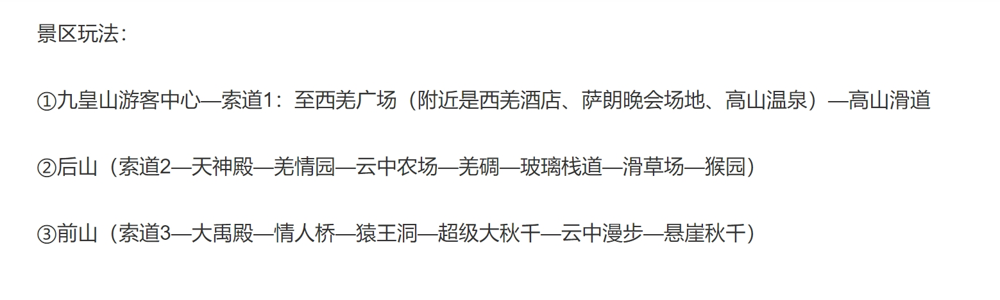

## 数据获取流程

### 爬取数据

通过爬虫获取原始信息，可能包括但不限于：**帖子名称**（title）、**地点**（place）、**行程**（route）、**正文**（description）、用户评论等。其中，我们选用了**帖子名称**（title）、**地点**（place）、**正文**（description）。

XXX 爬虫流程待补充 XXX

### 数据处理

#### 概述

考虑到数据来自于大量不同的网站和平台，且各个平台爬取的关键数据量参差不齐、大部分网站难以爬取精确地理位置、用户发帖打卡时间不能代表到达时间导致该数据不具有价值等因素，我们数据处理方式为：从数据库中解析出用户发帖的title,context/description等，进行NPL（Nature Language Process, 自然语言处理）。

在自然语言处理中，我们提出了两种方案：

- 利用哈工大 LTP平台（语言技术平台） 平台：进行NER（Named Entity Recognition，命名实体识别）以及利用正则表达式、词法分析技术进行时间提取。这样我们能获取帖子中**明文表示**的地点和时间，但是不能获取用自然语言表示的大致时间（如：今天正午），更重要的是不能准确获取地点与时间的**潜在关系**（如：十点到人民公园，半小时后到春熙路），导致数据无法有效处理；
- 使用 LLM（Large Language Model）+ Tool 构建Agent进行关键信息提取与匹配：LLM具有近似于人类的判断能力，能够通过自然语言提取出关键信息并推断未知信息，并以指定格式输出；Tool用传统的程序脚本获取、提供信息、LLM输出内容检查等，实现LLM精准处理文本内容为指定格式。



#### 处理

1. 准备阶段

    程序首先导入所需的库和模块，包括用于AI模型交互的ollama、数据处理的pandas等。
    它设置了一些全局配置，如使用的AI模型名称（这里是'gemma2'）、要处理的数据列名（'description'）、以及最大并行处理的文件数（8个）。
    程序还设置了日志记录，这样我们可以跟踪程序的运行过程和可能出现的问题。

2. AI模型交互

    程序定义了两个函数（use_llm1和use_llm2）来与AI模型交互。
    第一个函数（use_llm1）将旅行计划文本发送给AI模型，要求它规划出每个景点的到达时间。
    第二个函数（use_llm2）将第一个函数的结果再次发送给AI模型，要求它提取具体的时间和地点，并以JSON格式输出。
    这两个函数被组合在use_llm函数中，形成一个完整的AI处理流程。


3. 文件处理

    主程序会搜索'./data/'目录下所有的Excel和CSV文件。
    对于每个文件，程序会启动一个单独的处理流程（process_data_file函数）。


4. 数据处理流程

    对于每个文件：
    a. 程序首先读取文件内容（支持Excel和CSV格式）。
    b. 它会查找名为'description'的列（可以在配置中更改）。
    c. 对该列的每一行数据：

5. 将数据发送给AI模型处理（使用前面定义的use_llm函数）。
AI模型会分析旅行计划，推测出每个景点的预计到达时间。
    a. 收集所有处理结果。
    b. 将结果保存为一个新的JSON文件，文件名基于原文件名，加上'_processed'后缀。

6. 并行处理

    为了提高效率，程序使用了多线程技术。
    它可以同时处理多个文件（默认最多8个），大大加快了处理速度。

7. 结果输出

    处理完所有文件后，你会在原文件所在的目录找到对应的JSON文件。
    这些JSON文件包含了AI模型分析后的结构化旅行时间表，格式如下：
    ```json
    [
    {
        "location": "成都人民公园",
        "time": "12:00"
    },
    {
        "location": "成都博物馆",
        "time": "14:00"
    }
    ]
    ```

8. JSON提取
   
    这是一个巧妙的方法，用于从可能包含其他文本的AI模型响应中提取JSON数据：

    这段代码的目的是从AI模型的原始响应中准确提取JSON数据。它采用了一种灵活而稳健的方法，能够处理各种可能的情况。

    首先，代码假设有效的JSON数据应该被方括号 [] 包围（表示一个JSON数组）。它通过查找第一个左方括号和最后一个右方括号的位置来定位JSON数据的边界。这种方法很聪明，因为它允许JSON之前或之后存在其他文本。

    如果成功找到了方括号，代码就会提取它们之间的内容。这个提取的字符串应该是一个有效的JSON数组。然后，代码尝试将这个字符串解析成Python对象。如果解析成功，它就返回这个数据，同时在日志中记录解析后的内容，方便调试和验证。

    但是，代码也考虑到了可能出现的问题。如果JSON解析失败（例如，提取的内容不是有效的JSON），它会捕获这个错误，记录一条错误消息，并返回None。同样，如果在原始响应中根本找不到方括号，它也会记录一个错误并返回None。

    这种方法的优点在于它的健壮性。它能够处理AI模型可能返回的各种响应，包括那些在JSON前后可能包含额外文本的情况。同时，通过适当的错误处理和日志记录，它提供了清晰的反馈，有助于诊断和解决可能出现的问题。

9.  错误处理和日志

    整个过程中，程序会记录详细的日志，包括每个文件的处理进度、可能遇到的错误等。
    如果处理某个文件时遇到问题（例如文件格式不支持、缺少必要的列等），程序会记录错误但继续处理其他文件。